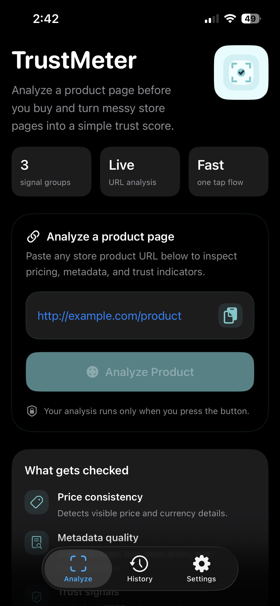
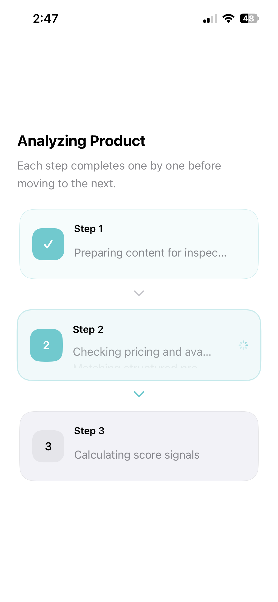
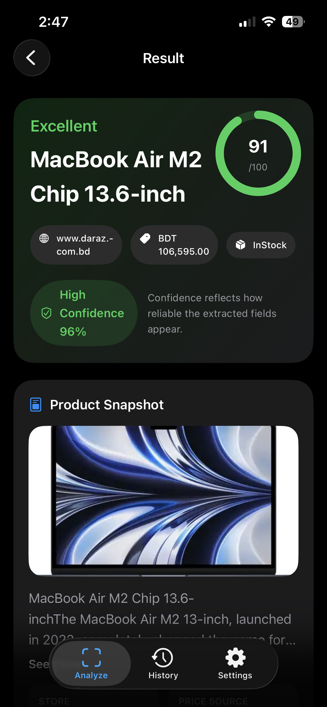
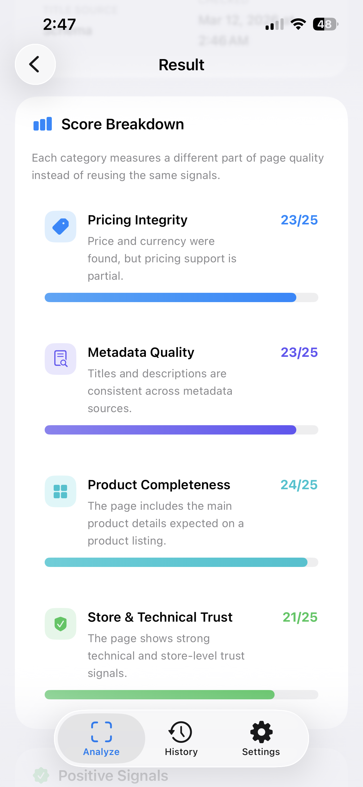
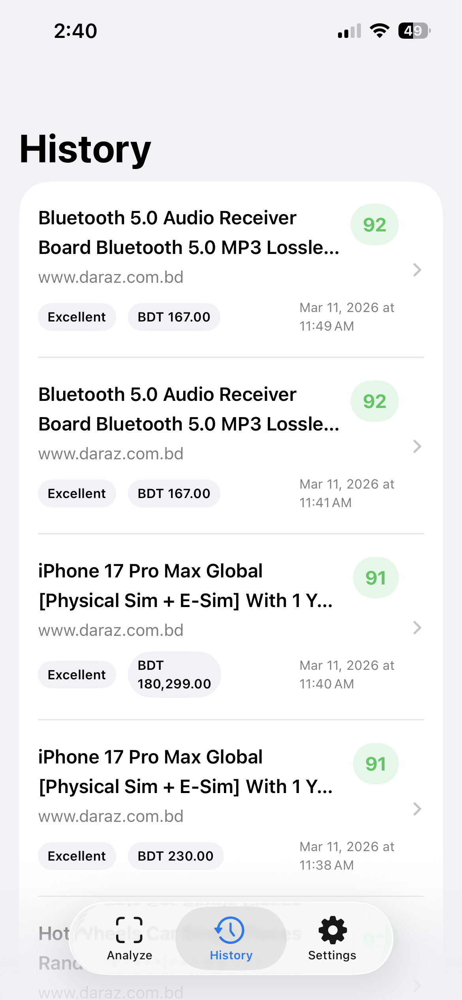
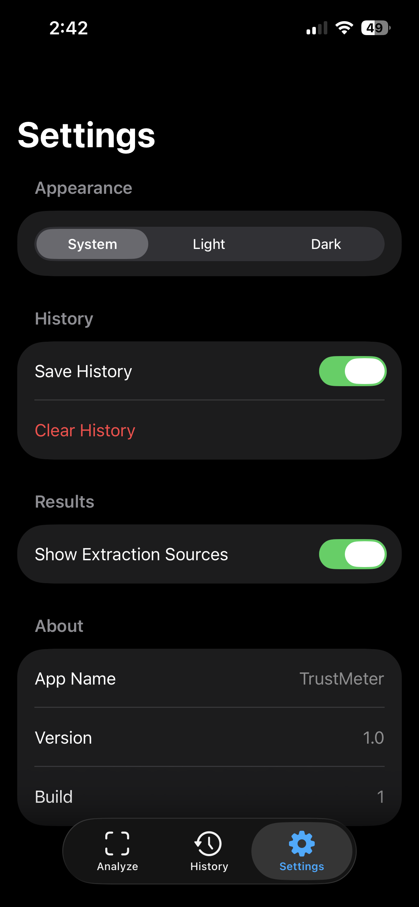

# 🛡️ TrustMeter

> **Analyze a product page before you buy and turn messy store pages into a simple trust score.**

[](https://creativecommons.org/licenses/by-nc/4.0/)


---

## 📱 About TrustMeter

**TrustMeter** is an iOS application built with SwiftUI that helps online shoppers verify the authenticity and reliability of e-commerce store product pages. By inputting any product page URL, TrustMeter automatically fetches web content, extracts structured data, and evaluates trust signals such as price consistency, metadata quality, and security indicators to compute a comprehensive **Trust Score**.

---

## 🛠️ Tech Stack & Architecture

- **UI Framework**: [SwiftUI](https://developer.apple.com/xcode/swiftui/) (Declarative UI components & dynamic themes)
- **Language**: Swift 5.7+ (Async/Await concurrency)
- **Architecture Pattern**: **MVVM** (Model-View-ViewModel)
- **Networking**: `URLSession` asynchronous data fetching
- **Parsing Engine**: Custom HTML DOM parser & JSON-LD schema extractor (`ProductPageParser`)
- **Scoring Engine**: Algorithmic multi-factor heuristic analyzer (`TrustScorer`)
- **Persistence**: `Codable` JSON storage backed by `UserDefaults` (`HistoryStore`)

---

## ✨ Key Features

- 🔍 **Live URL Analysis**: Paste any online product page link to instantly fetch and analyze its underlying metadata.
- 📊 **Dynamic Trust Scoring**: Comprehensive scoring algorithm evaluating:
  - **Price Consistency**: Detects visible price clarity, currency indicators, and unexpected discounts.
  - **Metadata Quality**: Evaluates Open Graph tags, product descriptions, images, and structured JSON-LD schemas.
  - **Trust & Security Signals**: Verifies HTTPS protocol, domain safety parameters, and vendor signals.
- 📜 **Historical Logs**: Automatically saves recent scans for fast offline retrieval and comparison.
- ⚙️ **Customizable Settings**: Manage history retention, theme preferences, and scanner behavior.

---

## 📸 Screenshots

|                       Analyze Product                        |                            Step Progress                            |                           Result Score                           |
| :----------------------------------------------------------: | :-----------------------------------------------------------------: | :--------------------------------------------------------------: |
|  |  |  |

|                         Score Breakdown                          |                          Scan History                          |                             Settings                             |
| :--------------------------------------------------------------: | :------------------------------------------------------------: | :--------------------------------------------------------------: |
|  |  |  |

---

## 📂 Project Structure

```
TrustMeter/
├── TrustMeterApp.swift          # Main entry point for the iOS application
├── App/                         # Global state & App navigation
│   ├── AppSettings.swift        # User preference configurations
│   └── RootTabView.swift        # Main tab interface
├── Models/                      # Data models
│   ├── AnalysisResult.swift     # Represents complete scoring output
│   ├── ProductData.swift        # Parsed product elements
│   └── ScoreBreakdown.swift     # Categorized score component breakdown
├── Services/                    # Core business logic & parsers
│   ├── AnalyzerService.swift    # High-level analysis workflow controller
│   ├── ProductPageParser.swift  # HTML and schema extraction logic
│   ├── TrustScorer.swift        # Multi-factor trust scoring engine
│   ├── HistoryStore.swift       # Local persistence manager
│   ├── URLInputNormalizer.swift # URL formatting & validation helper
│   └── WebPageFetcher.swift     # Asynchronous web content fetcher
├── Views/                       # SwiftUI user interfaces
│   ├── Home/                    # Input and primary analysis screen
│   ├── History/                 # Previous scan history list & details
│   └── Settings/                # User options & app configuration
└── screenshots/                 # App preview images
```

---

## 🚀 Getting Started

### Prerequisites

- **macOS**: 13.0 (Ventura) or later
- **Xcode**: 14.0 or later
- **Target OS**: iOS 16.0+
- **Language**: Swift 5.7+

### Building & Running

1. Clone this repository:
   ```bash
   git clone https://github.com/xyryc/TrustMeter.git
   cd TrustMeter
   ```
2. Open the Xcode project:
   ```bash
   open TrustMeter.xcodeproj
   ```
3. Select your target simulator (e.g. iPhone 15 Pro) or a connected physical iOS device.
4. Press `Cmd + R` to build and run the app.

---

## 📝 License

### 4. 🚫 Creative Commons Non-Commercial (CC BY-NC 4.0)

This project is licensed under the **Creative Commons Attribution-NonCommercial 4.0 International Public License**.

For full terms and details, please read the [LICENSE.md](LICENSE.md) file.
